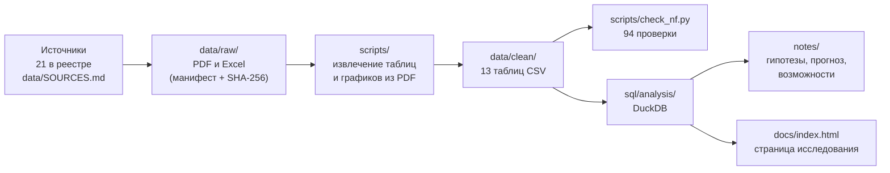

# Где предел роста цен в гостиницах Петербурга

Исследование гостиничного рынка Санкт-Петербурга на открытых данных
(октябрь 2026 года): что произошло с загрузкой и ценами, почему, тенденция ли
это, что будет в 2027 году и что из этого следует для отельера.

**Страница исследования:** [massimo-pazzi.github.io/hotel-market-case](https://massimo-pazzi.github.io/hotel-market-case/)
— 16 шагов от проверки данных до прогноза, каждый вывод с инфографикой
(исходник — [`docs/index.html`](docs/index.html)).
**Дашборд в Yandex DataLens:** [https://datalens.yandex/151am5wmftd4k](https://datalens.yandex/151am5wmftd4k) — те же данные, с
фильтром по федеральным округам; наборы данных и описание — в [`dashboard/`](dashboard/).
**Краткий текстовый отчёт:** [`report/spb_hotel_market_2027.md`](report/spb_hotel_market_2027.md).

## Главные выводы

- **Предел роста цен нащупан во втором полугодии 2025 года.** Отели впервые не
  смогли одновременно поднимать цену и сохранять гостей: загрузка упала на 3,8
  п. п. к прошлому году, в августе–сентябре доход на номер оказался ниже, чем
  годом раньше. Данные 2026 года из независимых источников это подтверждают.
- **Номеров становится больше, чем гостей.** С 2019 года номерной фонд
  качественных отелей вырос на 68%, турпоток — на 19%. По Росстату, гостей на
  один номер в Петербурге стало на 27% меньше — одно из сильнейших
  перенасыщений в стране.
- **Остановка выручки — общероссийская, остановка спроса — петербургская.**
  Доход на номер в 2026 году снижается в 16 из 26 городов, но число гостей по
  России растёт на 6%, а в Петербурге — нет.
- **Гости по-разному реагируют на цену в разные сезоны.** В январе–апреле цены
  поднимали на 11–18% без потери гостей, в мае–сентябре загрузка падала на 3–7
  пунктов. Летом и осенью 2025 года рынок потерял гостей, которые годом
  раньше приезжали и платили.
- **Базовый прогноз на 2027 год — загрузка около 60%** против 64% в 2025-м;
  топливо, налоговое давление и рост туристического налога сдвигают рынок к
  плохому сценарию.

## Как устроено исследование



Принципы:

- **Каждая цифра прослеживается до первоисточника.** Реестр
  [`data/SOURCES.md`](data/SOURCES.md): что, откуда, статус проверки,
  ограничения.
- **Таблицы в `data/clean/` получены только скриптами** — перенос можно
  повторить и проверить. Цифры, перенесённые вручную (опыт других рынков), лежат
  отдельно в [`data/context/`](data/context/) с источником у каждой строки.
- **Данные проверяются автоматически:** суммы частей, RevPAR = цена × загрузка,
  напечатанная динамика против пересчёта, сверка одних и тех же лет в разных
  выпусках. Найдено 21 расхождение — от опечаток до пересмотра прошлых лет.
- **Значения с графиков PDF восстановлены по векторным координатам** и сверены
  с опубликованными цифрами: отклонение не больше 1%.
- **Прогноз — сценарный, без машинного обучения:** десяти годовых точек для
  статистической модели мало, и это сказано прямо.

## Структура

```
data/SOURCES.md        реестр источников
data/raw_manifest.csv  ссылки и контрольные суммы исходных файлов
data/raw/              исходники: таблицы Росстата в репозитории, PDF — скачиваются
data/clean/            таблицы, полученные скриптами
data/context/          цифры, перенесённые вручную, с источниками
scripts/               загрузка, извлечение, проверки, сборка страницы
sql/setup.sql          подключение таблиц к DuckDB
sql/analysis/          запросы, на которых построены выводы
notes/                 гипотезы и их проверка, затраты, прогноз, возможности, глоссарий
report/                текст страницы и краткий отчёт
docs/index.html        страница исследования (для GitHub Pages)
dashboard/             наборы данных и описание дашборда DataLens
```

## Как воспроизвести

Нужны Python 3.12+ и [DuckDB CLI](https://duckdb.org/) 1.5.

```bash
python3 -m venv .venv && .venv/bin/pip install -r requirements.txt
bash scripts/run_all.sh
```

`run_all.sh` скачивает отчёты NF Group и IBC по ссылкам из манифеста, проверяет
контрольные суммы, заново извлекает все таблицы, прогоняет проверки и собирает
страницу. Любой запрос из `sql/analysis/` можно выполнить отдельно:

```bash
duckdb -c ".read sql/setup.sql" -c ".read sql/analysis/h1_supply_demand.sql"
```

Отчёты NF Group и IBC Real Estate — публикации этих компаний; в репозитории
только ссылки на них, а не копии.

## Источники

NF Group (обзоры гостиничного рынка Петербурга за 2023–2025 годы), IBC Real
Estate (данные Hotel Advisors за 2024–2026 годы), пресс-релиз Becar Asset
Management, Росстат (зарплаты, инфляция, гости и номера по регионам), ФНС и
закон Санкт-Петербурга о туристическом налоге, администрация Петербурга. Для
сравнения с другими рынками — STR, CoStar, JLL, HVS и отраслевая пресса. Полный
список со ссылками — в [`data/SOURCES.md`](data/SOURCES.md).

## Авторство

Автор — Максим Поципух: вопросы исследования, гипотезы, проверка и защита
выводов. Сбор и обработка данных, расчёты и тексты выполнены с помощью Claude
(Anthropic). Ход работы, включая ошибки и их исправление, показан на странице
исследования.
